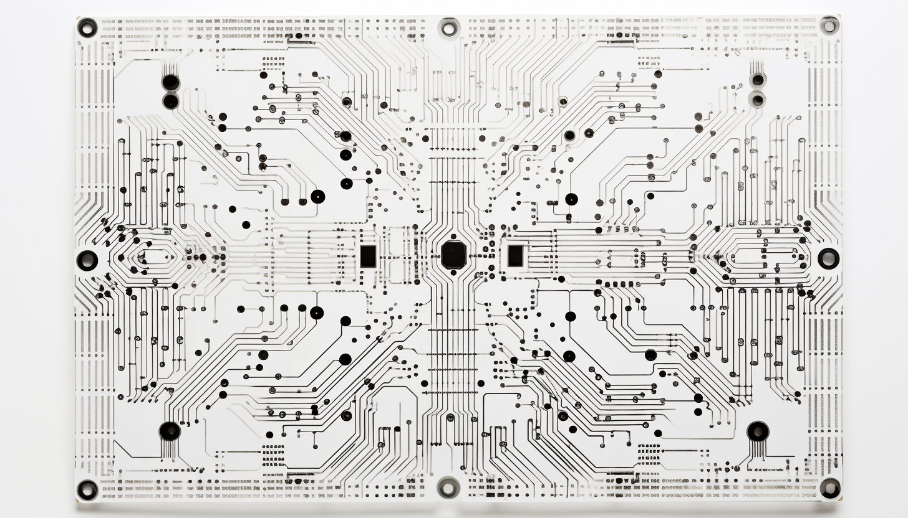

# Robotics

Robotics refers to the interdisciplinary field of study and practice involving the design, development, and application of robots. Robots are mechanical devices or intelligent machines designed to perform tasks autonomously or under human control. They are typically equipped with sensors, actuators, and a control system that allows them to perceive their environment, make decisions, and manipulate objects.
