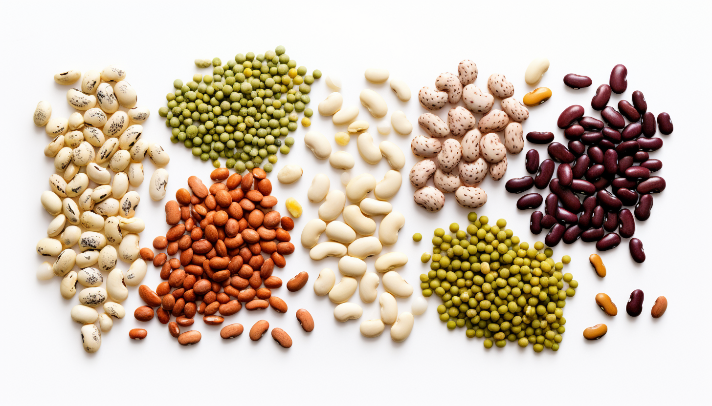

<h1 align="center"> Bean </h1>

One of the three sisters with [corn](./corn.md) and [squash](./squash.md)

Beans, encompassing a wide variety of legumes like black beans, kidney beans, and chickpeas, are a nutritional powerhouse and a staple in many diets. They are an excellent source of protein, particularly for those on plant-based diets, providing a full set of essential amino acids when paired with whole grains. Beans are rich in dietary fiber, which supports digestive health and helps regulate blood sugar levels. They contain various vitamins, such as folate and small amounts of Vitamin B6, and essential minerals including iron, magnesium, potassium, and zinc. Additionally, beans are low in fat and have a low glycemic index, making them suitable for weight management and heart health. The phytochemicals and antioxidants present in beans may also contribute to reducing the risk of chronic diseases.