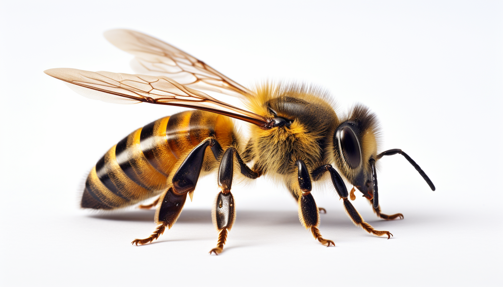

<h1 align="center"> Bee </h1>

# Polination

Bees play a crucial role in ecosystems as pollinators, facilitating the reproduction of flowering plants. By transferring pollen from one flower to another, they help in the production of fruits and seeds, supporting not only the plant populations but also the animals that depend on them for food. This pollination service is vital for the agricultural industry as well, as it enhances the yield of many crops that humans consume. 

# Honey

In addition to their ecological importance, bees are also known for honey production. Worker bees collect nectar from flowers and transform it into honey within the hive. This honey is not only a food source for the bees but has been harvested by humans for thousands of years. Rich in natural sugars, vitamins, and antioxidants, honey is valued both for its unique flavor and its medicinal properties.