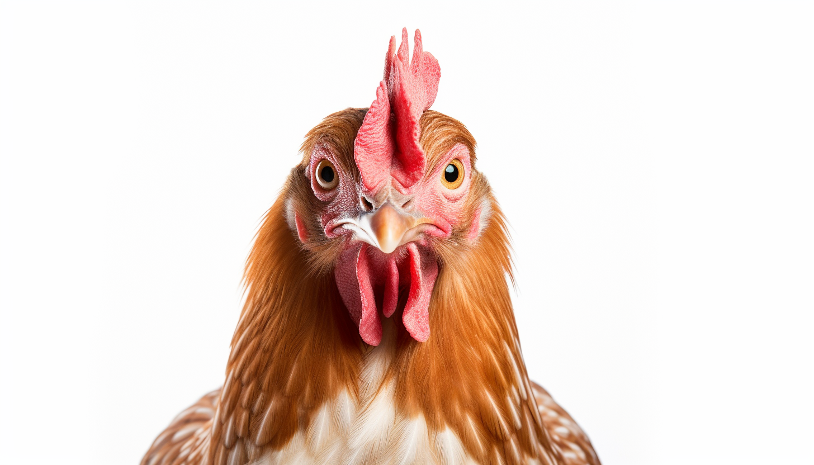

<h1 align="center"> Chicken </h1>

# Eggs

## Nutritional Profile

Large chicken egg (approx. 50g):

### Macronutrients:

1. Protein: ~6.5 grams
1. Fat: ~5.5 grams
    - Saturated fat: ~1.5 grams
    - Unsaturated fat: ~4 grams
1. Carbohydrates: ~0.5 grams
1. Fiber: 0 grams
    - Sugars: ~0.5 grams

### Micronutrients:

1. Vitamin A: ~195 IU
1. Vitamin D: ~17 IU
1. Vitamin B2 (Riboflavin): ~0.25 mg
1. Vitamin B12: ~0.55 mcg
1. Folate (Vitamin B9): ~24 mcg
1. Iron: ~0.9 mg
1. Zinc: ~0.65 mg
1. Calcium: ~27 mg
1. Magnesium: ~6 mg
1. Phosphorus: ~99 mg
1. Selenium: ~15.5 mcg
1. Choline: ~125.5 mg (important for brain health)

### Calories:

1. Calories: ~72-80 kcal per large egg

# Pest Control

Chickens serve an important ecological role through foraging. They naturally seek out and consume insects, seeds, and small plants, helping to control pest populations and recycle nutrients back into the soil.

# Meat

Chicken is an excellent source of high-quality protein, which is vital for muscle growth and repair, as well as for maintaining a healthy body overall. A single serving of chicken can provide a significant portion of the recommended daily protein intake.