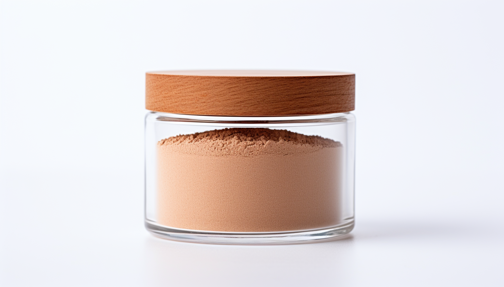

<h1 align="center"> Cricket </h1>

Crickets are increasingly being recognized as a sustainable and nutritious source of protein for both humans and other animals. Rich in essential amino acids, vitamins, and minerals, they offer a healthy alternative to traditional meat sources. Their production requires significantly less water and land than traditional livestock, making them an environmentally friendly option.

# Nutritional Profile

Nutritional profile of cricket flour, per 100 grams:

## Macronutrients:

1. Protein: 60-70 grams
1. Fat: 10-15 grams
    - Saturated fat: 3-4 grams
    - Unsaturated fat: 6-8 grams
1. Carbohydrates: 5-10 grams
    - Fiber: 2-3 grams
    - Sugars: 1-3 grams

## Micronutrients:

1. Vitamin B12: ~5 mcg (exceeds daily recommended intake)
1. Iron: 6-9 mg
1. Zinc: 5-7 mg
1. Calcium: 30-50 mg
1. Magnesium: 100-150 mg

## Amino Acids:

Cricket flour is a complete protein source, meaning it contains all essential amino acids in sufficient quantities.

## Fatty Acids:

Rich in Omega-3 and Omega-6 fatty acids.

# Frass

Cricket frass, the waste produced by crickets, is a valuable byproduct of cricket farming. It serves as an organic fertilizer rich in essential nutrients, and its antimicrobial properties offer a natural alternative to chemical pesticides. It is useful in agriculture, composting, and animal feed, making it a versatile and sustainable resource.