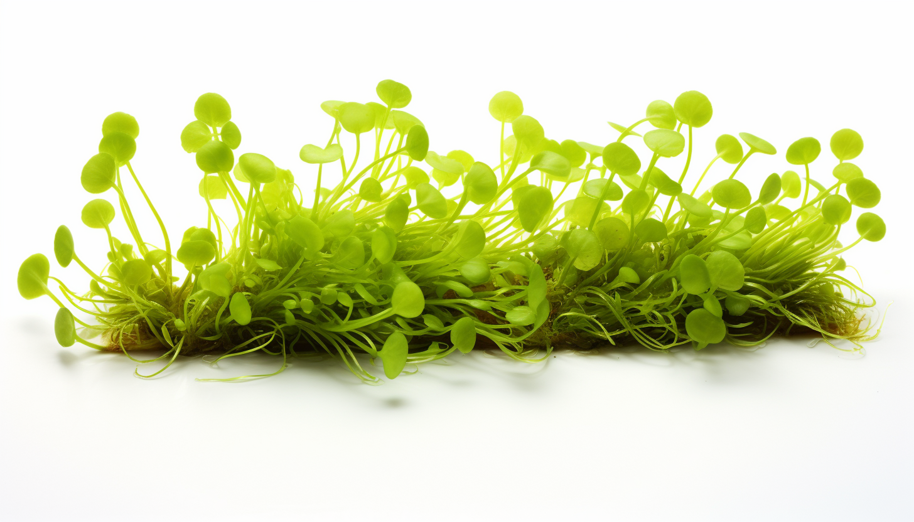

<h1 align="center"> Duckweed </h1>

Duckweed, a small floating aquatic plant, is gaining attention for its nutritional profile, especially as a potential protein source. It is remarkably rich in protein, with some species containing up to 45% protein by dry weight, encompassing a wide range of essential amino acids. Duckweed is also a source of dietary fiber and contains various vitamins, including Vitamin A, Vitamin C, and several B vitamins. Minerals like iron, calcium, and magnesium are present in notable quantities as well. Additionally, duckweed has omega-3 fatty acids, specifically alpha-linolenic acid (ALA), which is beneficial for heart health.