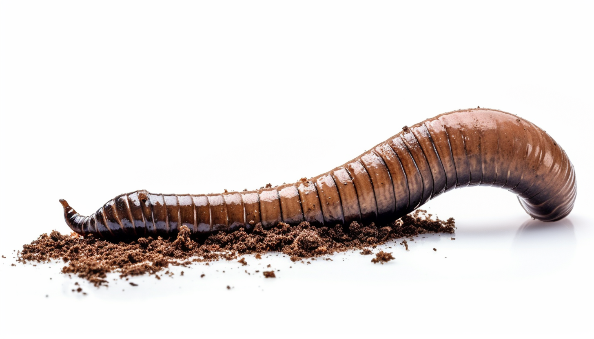

<h1 align="center"> Earth Worm </h1>

Vermicomposting is a process that leverages the natural decomposition abilities of worms, typically red wigglers, to convert organic waste into nutrient-rich compost known as worm castings. This method involves housing the worms in a bin with appropriate bedding, such as shredded newspaper, and feeding them organic waste like fruit and vegetable scraps. Over time, the worms consume the waste and excrete worm castings, a superior type of compost rich in nutrients and beneficial microorganisms. This method of composting is not only quicker than traditional methods, but it's also suitable for indoor environments or limited spaces, making it a versatile solution for waste management and organic gardening or farming.