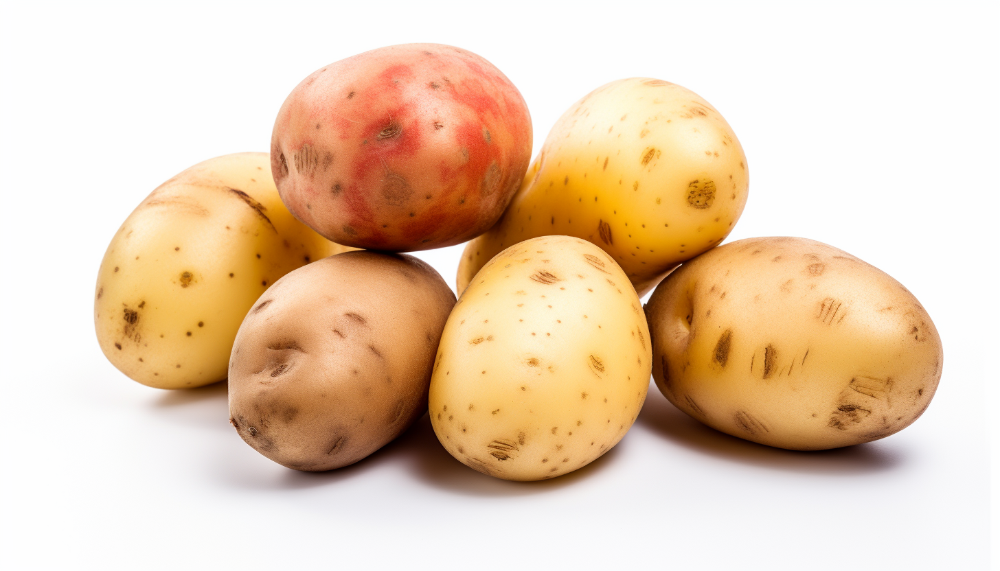

<h1 align="center"> Potato </h1>

The potato is a nutritious starchy tuber that is a staple in many diets around the world. It is an excellent source of carbohydrates, primarily in the form of complex carbohydrates like starch, and provides energy. Potatoes are also rich in essential vitamins and minerals such as Vitamin C, Vitamin B6, potassium, and manganese. Additionally, they contain a moderate amount of fiber, particularly in the skin, which can promote digestive health. However, potatoes are low in protein and fat. 