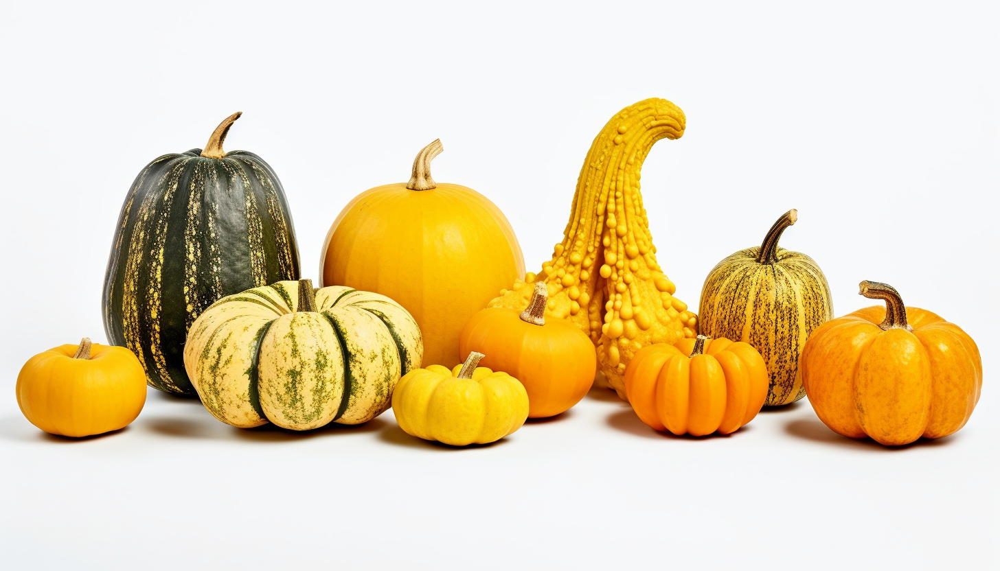

<h1 align="center"> Squash </h1>

One of the three sisters with [beans](./bean.md) and [corn](./corn.md)

Squash is a nutrient-dense vegetable that comes in various varieties, including butternut, acorn, and spaghetti squash. Rich in vitamins and minerals, squash is an excellent source of Vitamin A, particularly in the form of beta-carotene, which is vital for eye health and immune function. It also contains significant amounts of Vitamin C, Vitamin E, B-complex vitamins, potassium, and magnesium. Squash is low in calories and fat, and its high fiber content aids in digestion and helps maintain a healthy weight. Many types of squash also contain antioxidants like lutein and zeaxanthin, which may contribute to reducing the risk of chronic diseases.