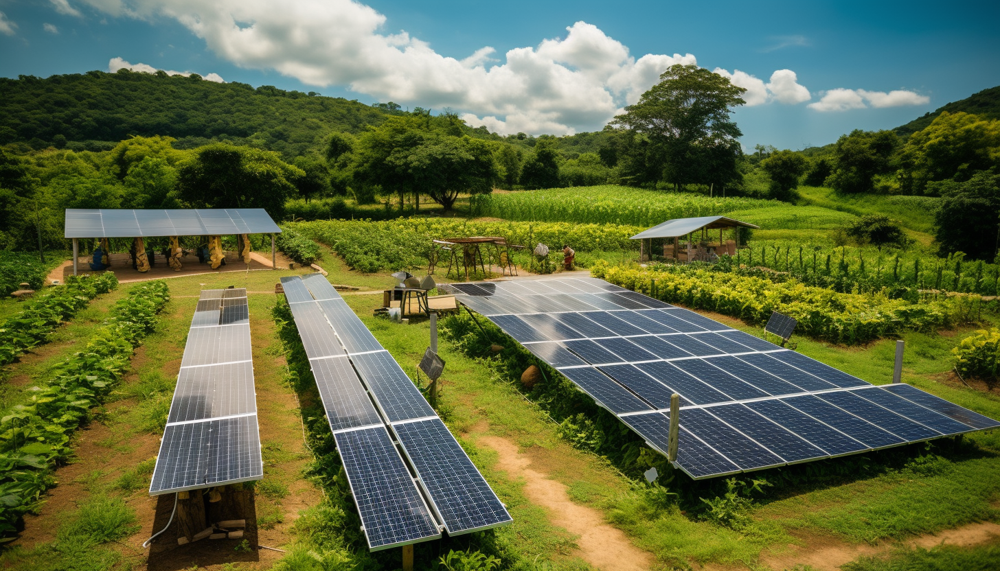

<h1 align="center"> Electricity </h1>

# Solar

Solar electric, also known as solar power or solar energy, is a renewable energy source that converts sunlight into electricity. It involves the use of photovoltaic (PV) cells or solar panels to capture the energy from the sun and convert it into usable electrical energy. These solar panels consist of semiconductor materials that generate a flow of electrons when exposed to sunlight.

# Wind

Wind electric, also known as wind power or wind energy, is a renewable energy source that harnesses the power of the wind to generate electricity. It involves the use of wind turbines, typically mounted on tall towers, which capture the kinetic energy of the wind and convert it into electrical energy. The wind causes the turbine blades to rotate, and this rotation drives a generator that produces electricity. 

# Hydro

Hydroelectric power, also known as hydropower, is a renewable energy source that generates electricity by harnessing the energy of flowing or falling water. It involves using dams or flowing rivers to control the flow of water, which drives turbines connected to generators.