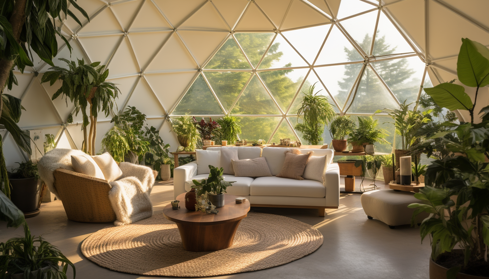
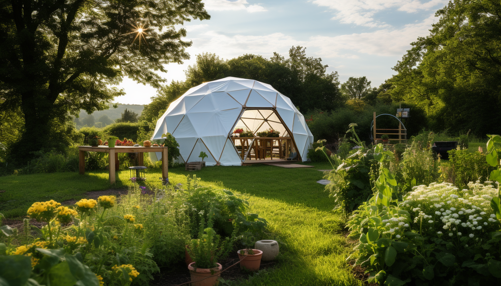
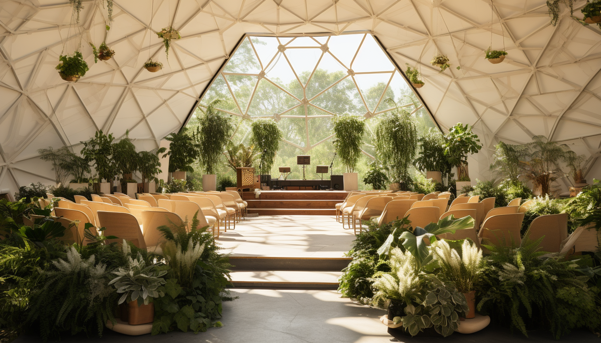
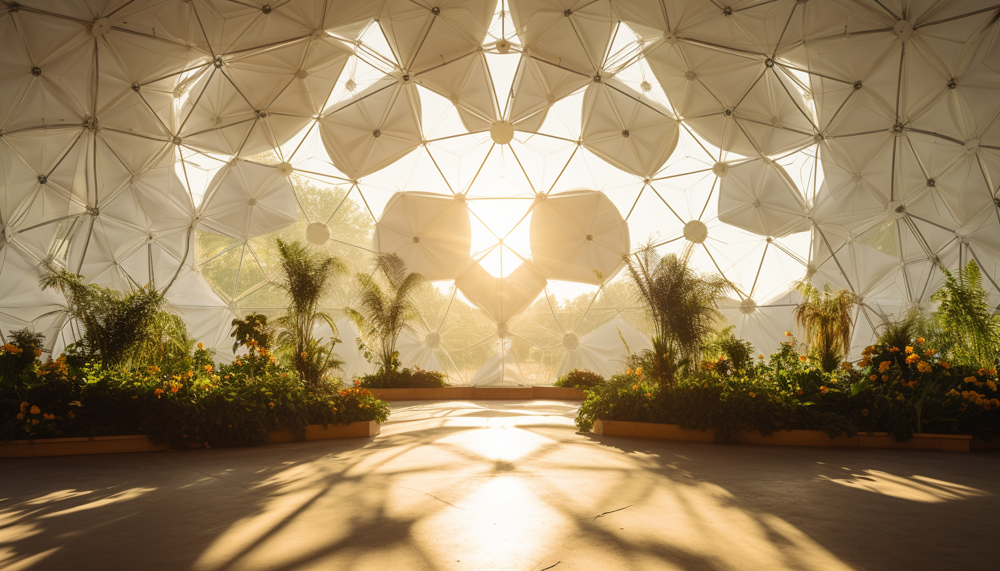
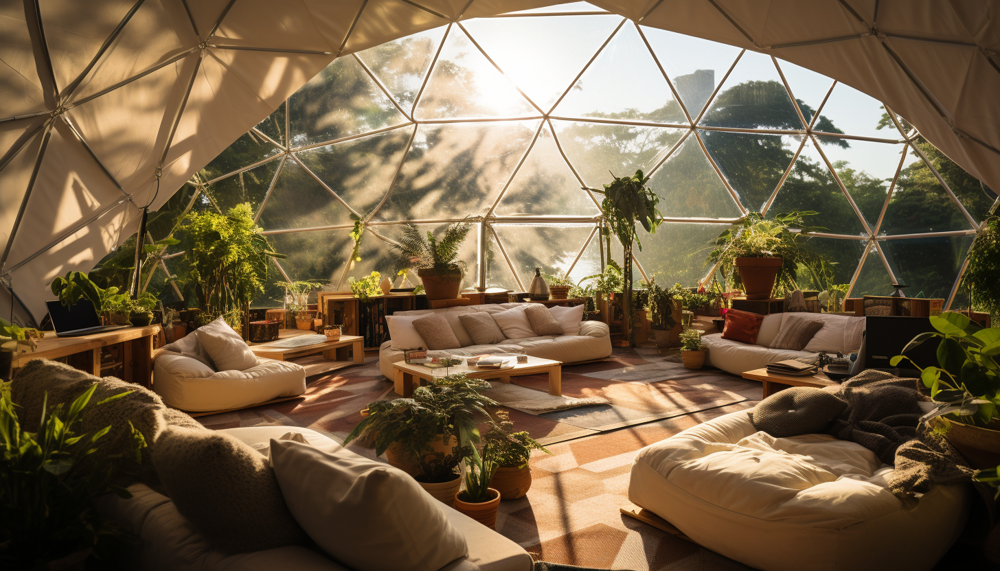

<h1 align="center"> Spaces </h1>

The commune, an epitome of shared living, is designed to foster a sense of community while still respecting the need for individual autonomy. It will feature both individual and collective living spaces, thus providing an intricate blend of privacy and social interaction. The layout will be strategically planned to encourage interaction and foster a spirit of camaraderie in the communal spaces, without compromising the sanctuary of personal spaces.

# Individual Space

[Pacific Dome Galery](https://pacificdomes.com/domes-media-gallery/dome-homes-gallery/)

## Housing

# Communal Space

## Conference Space

## Event Space

## Study Space

