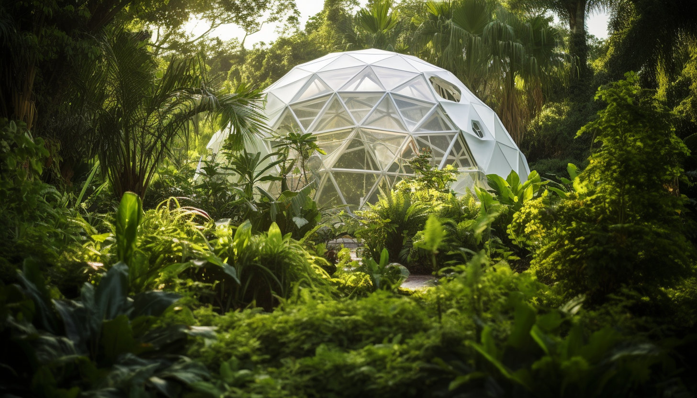

<h1 align="center"> Infrastructure </h1>

The infrastructure of a community represents the underlying foundation that facilitates the daily life and functioning of its members. Water infrastructure includes the purification and distribution systems that provide safe drinking water to residents. Energy infrastructure encompasses the production, transmission, and distribution of power, often through a combination of renewable and non-renewable sources. Buildings within the community, such as individual and collective spaces, are designed with both functionality and sustainability in mind.