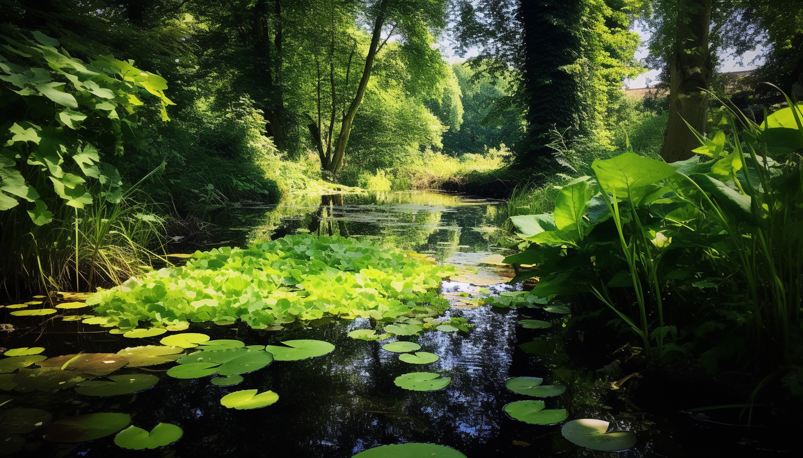
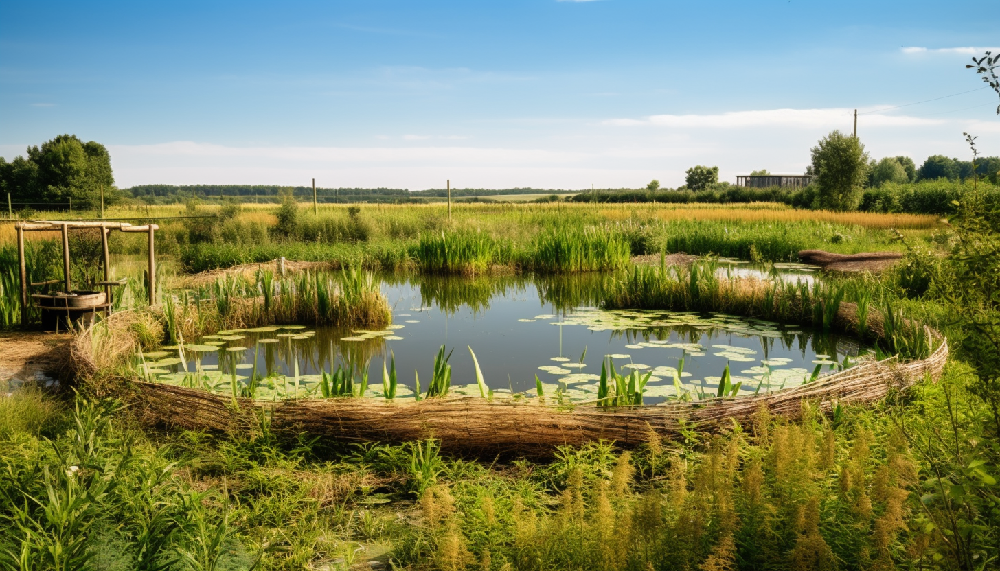
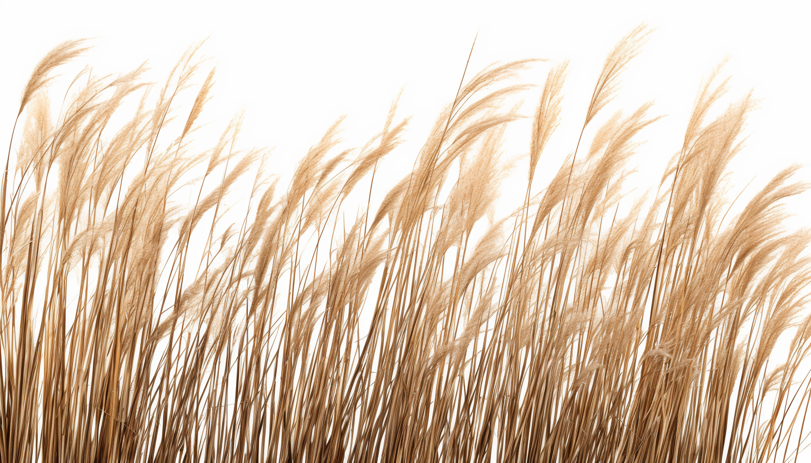
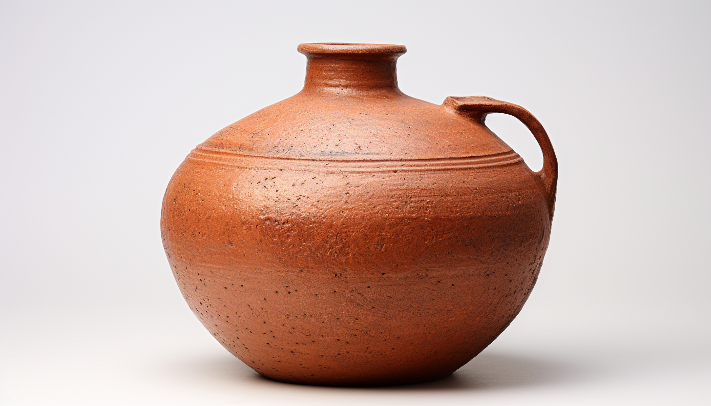

<h1 align="center"> Water </h1>

# Freshwater

- City water 
- Well water

# Water Capture

Water collection can be significantly enhanced by slowing down the runoff of water, thereby allowing it to seep into the soil more effectively. This approach involves the creation of barriers or interventions that reduce the speed of water as it moves over the land. By slowing the water's flow, these methods increase the time it has to infiltrate the soil, enhancing groundwater recharge and reducing surface runoff.

# Wastewater

## Greywater

Greywater refers to the wastewater generated from non-toilet plumbing fixtures and appliances in residential or commercial buildings. This type of wastewater includes water from sources such as:

- Sinks (kitchen and bathroom)
- Showers and bathtubs
- Washing machines
- Dishwashers

Greywater does not contain fecal matter, so it is considered less contaminated than blackwater. However, it can still have impurities and some level of chemical or organic content depending on the specific sources. 

Due to its relatively lower level of contamination, greywater can be treated and reused for certain non-potable purposes like irrigation, flushing toilets, and in some cases, laundry.

## Blackwater

Blackwater, on the other hand, is the wastewater that comes from toilets and contains human waste (feces and urine). It is highly contaminated and potentially carries harmful pathogens, making it a significant health risk. In addition to human waste, blackwater may also contain toilet paper and water used for flushing.

Due to its high level of contamination, blackwater must undergo extensive treatment before it can be safely discharged into the environment or reused. The treatment process for blackwater is more complex and requires higher levels of sanitation to ensure that harmful pathogens are removed effectively.

See [HTC](<./energy#Hydrothermal carbonization (HTC)>) for possible solutions.

# Irrigation

## Olla

Ollas are unglazed clay pots used for efficient irrigation, especially in dry climates. They are buried in the ground near plant roots and filled with water. The porous terracotta material allows water to seep directly into the root zone at a rate dependent on soil moisture levels, thus reducing water waste due to runoff and evaporation. Ollas are refilled as needed and promote the development of deep, healthy root systems.
