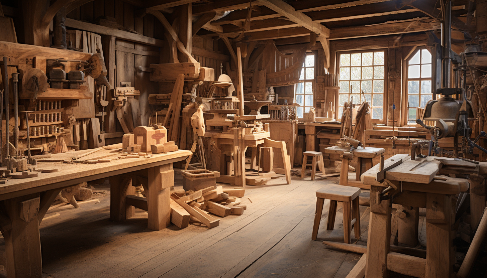

<h1 align="center"> Workshop </h1>

# 3D Printing

3D printing, also known as additive manufacturing, is a revolutionary technology that creates physical objects from digital designs. This process is achieved by laying down successive layers of material until the entire object is formed. The materials used can vary widely and include plastic, metal, ceramics, and even biological substances.

# Wood

Woodworking is the art, craft, or trade of designing and constructing items from wood. This practice involves various processes, such as cutting, shaping, and joining wood to create furniture, sculptures, decorative items, and structural elements like beams or panels.

# Art

The art workshop is a creative gathering designed to cultivate artistic skills, inspire creativity, and promote individual expression. In these workshops, participants engage in hands-on activities under the guidance of experienced artists or instructors. The focus can range from painting, drawing, and sculpture, to ceramics, photography, or digital art, among other forms. Participants have the opportunity to learn new techniques, improve existing skills, and explore different artistic mediums.

# Aquaponic

The aquaponics workshop is an educational event aimed at teaching participants the fundamentals of aquaponics, a sustainable method of food production that combines traditional aquaculture (raising aquatic animals such as fish) with hydroponics (cultivating plants in water). During the workshop, participants typically learn about the basic principles of aquaponics, including how the symbiotic relationship between plants and aquatic animals can create a self-sustaining ecosystem. This might involve understanding the nitrogen cycle, pH balance, water quality, and the types of plants and fish suitable for aquaponic systems. 